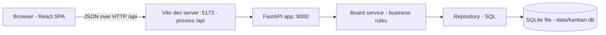
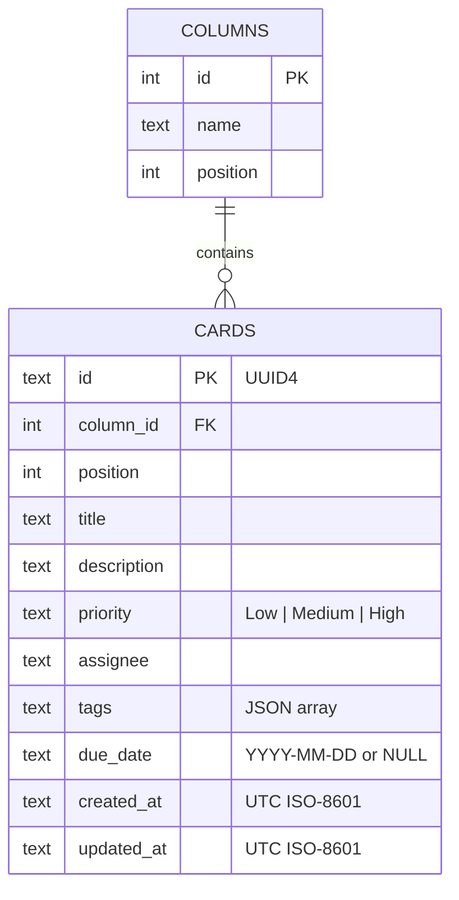

# Kanban Board — Architecture (v1 baseline)

**Status:** Implemented (v1 baseline)

## Overview



- **Frontend:** a React single-page app. It owns presentation, view-only search, and the overdue label. It never enforces business rules on its own.
- **Backend:** FastAPI is the source of truth for all board state and rules (validation, ordering, moves).
- **Storage:** a single SQLite file. It is created and seeded automatically on first start.

## Repository layout

```text
kanban-board-app/
├── README.md
├── docs/                  # spec.md, architecture.md, tech-stack.md
├── backend/
│   ├── requirements.txt
│   ├── app/
│   │   ├── main.py        # FastAPI app, CORS, startup (create schema + seed if empty)
│   │   ├── api.py         # HTTP routes only: parse → call service → map errors
│   │   ├── schemas.py     # Pydantic request/response models and validation
│   │   ├── service.py     # Business rules: create, edit, move, reorder, delete, reset
│   │   ├── repository.py  # All SQL (sqlite3); no business rules
│   │   ├── db.py          # Connection handling, schema DDL, DB path config
│   │   └── seed.py        # Fictional demo data
│   └── tests/             # pytest + FastAPI TestClient, isolated temporary DB per test
└── frontend/
    ├── package.json
    ├── vite.config.ts     # dev proxy /api → http://localhost:8000
    └── src/
        ├── api.ts         # Typed API client (the only place that calls fetch)
        ├── types.ts       # Board, Column, Card types mirroring the API
        ├── utils.ts       # Pure view helpers: overdue check, search match, local date
        ├── App.tsx        # Loads the board, owns state, search box, reset
        ├── components/    # Board, Column, CardItem, CardDialog, ConfirmDialog
        └── __tests__/     # Vitest + React Testing Library
```

## Backend layers

| Layer | Responsibility | Must not |
|---|---|---|
| `api.py` | Routes, status codes, mapping service errors to HTTP | Contain business rules or SQL |
| `schemas.py` | Input validation (lengths, enums, trimming), response shapes | Access the database |
| `service.py` | Rules: placement, contiguous positions, move/reorder, delete renumbering | Build HTTP responses |
| `repository.py` | Parameterised SQL reads and writes, within a transaction | Decide business outcomes |

Every change to board state goes through `service.py`. This is the single place where a future rule, such as WIP limits, would be enforced.

## Data model



- Uniqueness constraint on (`column_id`, `position`) for cards. Moves renumber inside one transaction.
- Columns are seeded once and are fixed in v1.

## API

All endpoints are under `/api`. Errors use the shape `{"detail": "<message>"}`.

| Method | Path | Purpose | Success | Errors |
|---|---|---|---|---|
| GET | `/api/health` | Liveness check | 200 | — |
| GET | `/api/board` | Board with ordered columns and cards | 200 | — |
| POST | `/api/cards` | Create a card (`column_id` + fields); placed at the bottom | 201 card | 404 column, 422 validation |
| PATCH | `/api/cards/{id}` | Edit title, description, priority, assignee, tags, due date | 200 card | 404, 422 |
| POST | `/api/cards/{id}/move` | Move or reorder (`column_id`, `position`) | 200 board | 404, 422 invalid target |
| DELETE | `/api/cards/{id}` | Delete the card and renumber its column | 204 | 404 |
| POST | `/api/board/reset` | Restore the demo data | 200 board | — |

- Search is client-side, over the loaded board. The board is small, so there is no search endpoint.
- Move returns the full board so the UI can re-render both affected columns consistently.

## Frontend flow

1. `App` loads `GET /api/board` and holds it in state.
2. User actions call `api.ts`. On success, state is replaced with the server response. On failure, an inline error is shown and state is unchanged.
3. Move buttons (`←` `→` `↑` `↓`) on each card call `/move`. Buttons are disabled when a move is impossible (first column, top of column, and so on).
4. Search filters the rendered cards only. Column counts always show the true totals.

## Cross-cutting concerns

- **Configuration:** `KANBAN_DB_PATH` (default `backend/data/kanban.db`). The tests use a temporary path.
- **CORS:** allows only `http://localhost:5173`, for local development.
- **Security:** no secrets or credentials; parameterised SQL only; input lengths bounded by the schemas; data is fictional.
- **Time:** the server stores UTC. The overdue label is computed in the browser against the local date.

## Testing strategy

| Level | Tool | Focus |
|---|---|---|
| Backend unit/API | pytest + TestClient | Validation, create/edit/move/reorder/delete, contiguity, reset, 404/422 |
| Frontend component | Vitest + React Testing Library | Board render, create validation, overdue label, search, move, error display |
| Browser | Antigravity browser agent (during the demo) | End-to-end checks in Chrome |
